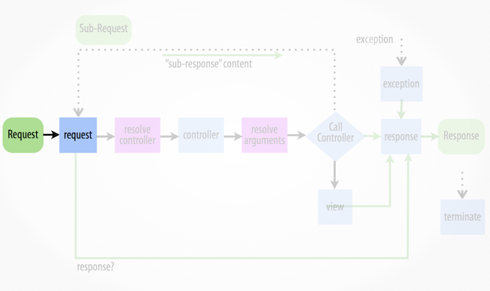
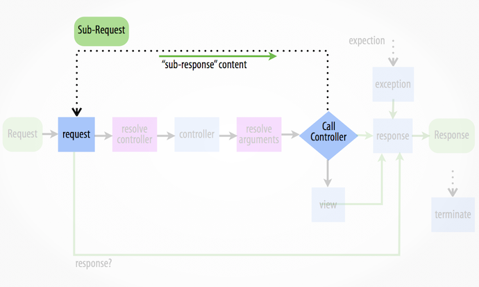

# Symfony2 for Beginners


## Hi, my name is ...
\centering


\begin{huge}
Julius Beckmann
\end{huge}

\vspace{0.5cm}
and i work at


## ... and i do:
\centering

\Large

- PHP, Symfony2
- Erlang, Elixir
- NodeJS
- DevOps + Continuous Everything!

\vspace{0.5cm}

\Large
(github|twitter).com/h4cc


# Agenda

## Agenda 1/2

\centering
\Large

* What is Symfony?

. . . 

* Howto
    * Install
    * Develop
    * Deploy
  
## Agenda 2/2

* Plain PHP to Symfony
    * Starting Point
    * Dispatching
    * Routing
    * Symfony HTTP Foundation
    * Symfony HTTP Kernel
    * Symfony Routing
    * Symfony Controller

. . . 

* Extending Symfony Kernel
    * Kernel Events
    * Request/Response Flow
    * (Subrequests)


# What is Symfony?

## What is Symfony?

\centering
\Large

* Abstract:
    * PHP Web Application Framework
    * At least PHP 5.3.3
    * By Fabien Potencier _(fabpot)_

. . . 

* Versions:
    * v1 since 2005 _(legacy)_
    * v2 since 2011
    * v3 in November 2015

------------------------------------

\centering
\Large

* Patterns:
    * Framework Components
    * Modular design (Bundles)
    * Dependency Injection
    * Event Dispatcher

. . . 

* Used by:
    * Drupal 8
    * eZPublish 5
    * Contao 4
    * phpBB 3
    * ... 


# Installing Symfony


## Symfony Installer

A tool for bootstrapping new Symfony projects.

. . . 

### Installing the installer

```bash
curl -LsS http://symfony.com/installer -o symfony.phar

chmod a+x symfony.phar
```

. . . 

### Using the installer

```bash
php symfony.phar new blog

php symfony.phar new blog 2.3

php symfony.phar new blog 2.5.2
```

## Composer

Manual way of bootstrapping symfony projects.

```bash
php composer.phar create-project \
    symfony/framework-standard-edition \
    blog "2.3.*"
```

. . . 

This will do:
\small

1. `git clone https://github.com/symfony/symfony-standard blog`
2. `cd blog`
3. `git checkout v2.3.X`
4. `rm -rf .git`
5. `composer install`


# Development


## Development

### Using the PHP >=5.4 internal Webserver
```bash
php app/console server:run
# or
php -S 127.0.0.1:8080 -t web/
```

. . . 


### Frontend Tools 

* `php app/console assets:install`
* `php app/console assetic:dump`
* Grunt, Gulp, Brunch


# Deployment

## Deployment

__Poor-Man example__:

### Initial
```bash 
git clone git@github.com:your/project.git /var/www
cd /var/www
# ensure correct permissions on app/cache and app/logs
```
 
. . . 

### Deploy
```bash 
git pull
rm -f web/app_*.php
composer install
php app/console cache:clear --env=prod
# ... more needed commands like "doctrine"
```

| Tools: [Capifony](http://capifony.org/), Ansible, SaltStack, Puppet, Chef.
| Automation with: [Jenkins](http://jenkins.org/).


# From plain PHP to Symfony

## Starting point
\centering

\LARGE
_GET /post.php?id=1_
\large

```php
<?php // post.php

$postId = (int)$_GET['id'];
$posts = array(1 => 'My first post');

if(!isset($posts[$postId])) {
	header("HTTP/1.0 404 Not Found");
	die('Post not found');
}

$post = $posts[$postId];
echo '<h1>Post #', $postId, '</h1>
	  <p>', $post, '</p>';
```

# Webserver Rewrites

## Using rewrites
\centering

\LARGE
_GET /post/1_
\large

### .htaccess Configuration
```
RewriteEngine on 
RewriteRule ^post/([0-9]+)$ post.php?id=$1
```

. . . 

### Problems

* Depends on Webserver
* Static configuration
* _Outside_ of Application


# Dispatcher and Routing


## Using dispatcher
\centering

### .htaccess Configuration
```
RewriteEngine On
RewriteRule ^(.*)$  /index.php [QSA]
```

. . .

### index.php with Routing

```php
<?php // index.php

$path = $_SERVER['PATH_INFO'];

// Routing
if(preg_match("@^/post/(?P<id>[0-9]+)@", $path, $m)){
	$_GET['id'] = $m['id'];
	require('controller/post.php');
}else{
	require('controller/index.php');
}
```


# Symfony HTTP Foundation


## Symfony HTTP Foundation

\centering
\LARGE

1. Using HTTP as a __Interface__

. . .
 
2. __Hiding__ PHP-ServerAPI \begin{small}$\rightarrow$ \$\_GET, \$\_POST, \$\_SERVER, echo(), header(), die() \ldots \end{small} 

. . .

3. __Providing__ Request/Response Objects


## Symfony Request Class


```php
<?php
use Symfony\Component\HttpFoundation\Request;

$_GET['foo'] = 42;
$_POST['bar'] = 1337;

$request = Request::createFromGlobals();

$request->query->get('foo'); // from _GET
$request->request->get('bar'); // from _POST

$request->get('foo'); // from any source.
```

Encapsulates `$_GET, $_POST, $_COOKIE, $_FILES and $_SERVER`


## Symfony Response Class

```php
<?php
use Symfony\Component\HttpFoundation\Response;

return new Response('Hello World', 200);
```

. . . 

- Capsules response content, status and headers.
- Some Helper:
    - `JsonResponse(array('answer' => 42))`
    - `RedirectResponse('http://example.com/', 302)`
    - `StreamedResponse(function() {...})`
    - `BinaryFileResponse('images/42.jpg')`


## Benefits

\centering
\LARGE

1. Reproducible $\rightarrow$ __Testable__

. . . 

2. Common Interface $\rightarrow$ __Reuseable__


# Symfony HTTP Kernel


## Http Kernel Interface

\footnotesize

```php
<?php
interface Symfony\Component\HttpKernel\HttpKernelInterface {
    const MASTER_REQUEST = 1; // External request (from browser).
    const SUB_REQUEST = 2;    // Internal request.

    /** @return Response */
    public function handle(Request $request, $type=1, $catch=true);
}
```

\normalsize
A HttpKernel __has__ to transform `Request` to `Response`.


## HTTP Kernel
\centering

\footnotesize

```php
<?php // index.php

class ExampleKernel implements HttpKernelInterface {
    public function handle(Request $req) {
   
        // Step 1: Routing
        $controller = $this->routeRequestToController($req);
        
        // Step 2: ?
        $response = $this->callRequestOnController($controller, $req);
        
        // PROFIT!!!
        return $response;
    }
    // ... 
}

$kernel = new ExampleKernel();
$response = $kernel->handle(Request::createFromGlobals());
$response->send();
```


# Symfony Routing

## Symfony Routing

### Goal

\centering

> Find Controller and Action for given Request.

. . . 

### Example Blog Post Route

```yaml
# app/config/routing.yml

blog_post_show:             # Name of route
    path: /post/{id}            # Pattern with placeholders
    defaults:
        _controller: BlogBundle:Post:show
    requirements:
        id: \d+                 # Regex possible
        _method: GET            # Ensure used method
```

## Symfony Routing - Generate URLs

\centering
\small

### From PHP using "router"

```php
<?php
$router = $this->get('router');

$path = $router->generate('blog_post_show', ['id' => 42]);
$url = $router->generate('blog_post_show', ['id' => 42], true);
```

. . . 

### From Twig using helper

```django

<a href="{{ path('blog_post_show', {'id': 42}) }}">
    Relative URL
</a>

<a href="{{ url('blog_post_show', {'id': 42}) }}">
    Absolute URL
</a>

```


## Symfony Routing - Tipps


### Routing to static page

```yaml
imprint:
    path: /imprint
    defaults: 
        _controller: FrameworkBundle:Template:template
        template:    static/imprint.html.twig
```

. . . 

### Routing to static redirect

```yaml
admin_shortcut:
    path: /admin
    defaults: 
        _controller: FrameworkBundle:Redirect:urlRedirect
        path:        /backend/administration/login
        permanent:   false
```


# Symfony Controller


## Symfony Controller

\centering
\LARGE

*Request* $\rightarrow$ Controller $\rightarrow$ *Response*

. . . 

\raggedright
\normalsize


```php
<?php
class HelloController {
    public function worldAction(Request $request) {
    
        // Translate Request to application logic here ...
        
        $content = 'Hello '.$request->get('name', 'World');
    
        // ... and create Response for result.
    
        return new Response($content, 200);
    }
}
```

# post.php as Symfony Controller


## PostController

\centering
\footnotesize

```php
<?php // src/BlogBundle/Controller/PostController.php

class PostController extends Controller {
    public function showAction(Request $request) {
    
        $id = $request->get('id');
        
        $post = $this->getDoctrine()
            ->getRepository('BlogBundle:Post')
            ->find($id);
            
        if(!$post) {
            // Using exceptions here.
            throw $this->createNotFoundException('Post not found');
        }
        
        return new Response('<h1>Post #'. $post->getId(). '</h1>
	                         <p>'. $post->getContent(). '</p>', 200);
    }
}
```

# Parameter injection

## Parameter injection

\centering
\footnotesize

```php
<?php // src/BlogBundle/Controller/PostController.php

class PostController extends Controller {
    public function showAction($id) { // <-- Parameter from route
    
        $post = $this->getDoctrine()
            ->getRepository('BlogBundle:Post')
            ->find($id);
            
        if(!$post) {
            throw $this->createNotFoundException('Post not found');
        }
        
        return new Response('<h1>Post #'. $post->getId(). '</h1>
	                         <p>'. $post->getContent(). '</p>', 200);
    }
}
```

# Templating

## Templating

\centering
\footnotesize

```php
<?php // src/BlogBundle/Controller/PostController.php

class PostController extends Controller {
    public function showAction($id) {
    
        $post = $this->getDoctrine()
            ->getRepository('BlogBundle:Post')
            ->find($id);
            
        if(!$post) {
            throw $this->createNotFoundException('Post not found');
        }
        
        // Using template system
        return $this->render('post/show.html.twig',  ['post' => $post]);
    }
}
```

# ParamConverter Annotation

## ParamConverter Annotation

\centering
\footnotesize

```php
<?php // src/BlogBundle/Controller/PostController.php

use Sensio\Bundle\FrameworkExtraBundle\Configuration\ParamConverter;

class PostController extends Controller {
    /**
     * @ParamConverter()
     */
    public function showAction(Post $post) { // Post from DB or 404
    
        return $this->render('post/show.html.twig',  ['post' => $post]);
    }
}
```

# Template Annotation

## Template Annotation

\centering
\footnotesize

```php
<?php // src/BlogBundle/Controller/PostController.php

use Sensio\Bundle\FrameworkExtraBundle\Configuration\ParamConverter;

class PostController extends Controller {
    /**
     * @ParamConverter()
     * @Template("post/show.html.twig")
     */
    public function showAction(Post $post) {
        return ['post' => $post];
    }
}
```


## Template Annotation

\centering
\footnotesize

```php
<?php // src/BlogBundle/Controller/PostController.php

use Sensio\Bundle\FrameworkExtraBundle\Configuration\ParamConverter;
use Sensio\Bundle\FrameworkExtraBundle\Configuration\Template;

class PostController extends Controller {
    /**
     * @ParamConverter()
     * @Template("post/show.html.twig", vars={"post"})
     */
    public function showAction(Post $post) {}
}
```

# Route Annotation

## Route Annotation

\centering
\footnotesize

```php
<?php // src/BlogBundle/Controller/PostController.php

use Sensio\Bundle\FrameworkExtraBundle\Configuration\ParamConverter;
use Sensio\Bundle\FrameworkExtraBundle\Configuration\Template;
use Sensio\Bundle\FrameworkExtraBundle\Configuration\Route;

class PostController extends Controller {
    /**
     * @Route("/show/{id}", requirements={"id"="\d+", "_method"="GET"})
     * @ParamConverter()
     * @Template(vars={"post"})
     */
    public function showAction(Post $post) {}
}
```


# Extending the Symfony Kernel


## Kernel Events

\Large

> Symfony is using Events to process Requests.

. . . 

\normalsize

### Every Request

* __kernel.request__
* __kernel.controller__
* __kernel.response__

. . . 

### Optional

* __kernel.view__
* __kernel.exception__
* __kernel.terminate__


<!--
kernel.request: RouterListener -> _controller
resolve controller: _controller -> BlogBundle/Controller/FooController.php
kernel.controller: Profiler und ParamConverter
resolve arguments: postAction($slug, Request $r) => array('cool-post', $request)
call controller: postAction('cool-post', $request) -> $result
if(NOT $result is response) {
    kernel.view $result -> $response // View layer
}
if(NOT $response is response) {
    throw exeception
}
kernel.response profiling, Toolbar
kernel.terminate Afterwards event.

kernel.exeception
-->


## Event kernel.request
\vspace{0.5em}



## Resolve Controller
\vspace{0.5em}


## Event kernel.controller
\vspace{0.5em}


## Controller Arguments
\vspace{0.5em}


## Call Controller
\vspace{0.5em}


## Call Controller
\vspace{0.5em}


## Event kernel.view
\vspace{0.5em}


## Event kernel.exception
\vspace{0.5em}


## Symfony HttpKernel Events

\tiny


```php
<?php // Example implementation of symfony kernel-events.
class HttpKernel implements HttpKernelInterface, TerminableInterface {
  public function handle(Request $req) {
    try {
      $gre = $this->dispatch('kernel.request', new GetResponseEvent($req));
      if($gre->hasResponse()) {
        $resp = $gre->getResponse();
        goto response;
      }
      
      $this->resolveController($req);
      $controller = $this->dispatch('kernel.controller', new FilterControllerEvent($req));
      $this->resolveArguments($req);
      
      $resp = $this->callController($controller, $req);
      
      if(!$resp instanceof Response) {
        $grfcre = new GetResponseForControllerResultEvent($req, $resp);
        $resp = $this->dispatch('kernel.view', $grfcre)->getResponse();
      }
      
    }catch(Exception $e) {
      $resp = $this->dispatch('kernel.exception', new GetResponseForExceptionEvent($req, $e))->getResponse();
    }
    
    response:
      return $this->dispatch('kernel.response', new FilterResponseEvent($req, $resp))->getResponse();
  }
  
  public function terminate(Request $req, Response $resp) {
    $this->dispatch('kernel.terminate', new PostResponseEvent($req, $resp));
  }
}
```


# Questions?


# Symfony Sub-Requests

## Sub-Requests: Flow



## Sub-Requests: Example

\centering
\footnotesize

### Forwarding
```php
<?php
public function impressumAction($name) {
    $response = $this->forward('ExampleContentBundle:Static:imprint');
}
```
 
. . . 

### Rendering Templates

```djangotemplate
{{ render(url('/partial/footer.html')) }}

{# ... or ... #}

{{ render(controller('ExampleContentBundle:Partial:footer')) }}
```

# The end!

{
    \usebackgroundtemplate{\includegraphics[width=\paperwidth]{figure}}
    \begin{frame}[plain]
        \includegraphics[width=\paperwidth]{images/doge-symfony.png}
    \end{frame}
}


